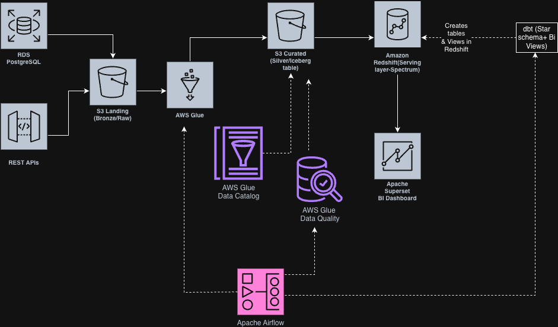

## Table of Contents
- [Introduction](#1-introduction)
- [Problem Statement](#2-problem-statement)
- [Architecture Overview](#3-architecture-overview)
- [Technologies Used](#4-technologies-used)
- [Pipeline Execution](#5-pipeline-execution-conceptual)
- [What I Learned](#6-what-i-learned)
- [Challenges Faced](#7-challenges-faced)
- [Project Structure](#8-project-structure)
- [Deployment Notes](#9-notes)

## Repository Contents
- Glue scripts: `glue/`
- Terraform skeleton: `terraform/`
- dbt models: `dbt/`
- Airflow DAGs: `airflow/dags/`
- Data quality rules: `data_quality/`
- Superset notes: `superset/`
- Deployment notes: `docs/deployment.md`

DeFtunes Architecture
### End-to-End Data Engineering Pipeline with AWS, Iceberg, Redshift, dbt, Airflow

## 1. Introduction

DeFtunes is a music streaming company that recently expanded into digital song purchases. With this new business capability, the analytics team requires a reliable and scalable data platform to analyze customer purchases, user behavior, and sales trends.

This project implements an end-to-end data engineering pipeline that ingests data from operational systems and APIs, processes it using a medallion (Bronze–Silver–Gold) architecture, and delivers analytics-ready data to downstream consumers using modern cloud-native tools.

---

## 2. Problem Statement

DeFtunes is a digital music platform that requires a scalable and reliable data
platform to analyze song purchases, user activity, and revenue trends.

Data is generated from multiple operational sources, including a transactional
database and external APIs, and must be ingested, transformed, and modeled to
support analytics and reporting use cases.

The objective of this project is to design and implement an **end-to-end data
lakehouse architecture** that:
- Ingests data from heterogeneous sources
- Applies transformations using a medallion (Bronze, Silver, Gold) architecture
- Stores curated data in a query-optimized format
- Enables analytics consumption through a structured serving layer

---

## 3. Architecture Overview
## Architecture Diagram

This project follows a **Lakehouse Medallion Architecture**:

- **Landing (Bronze) Layer**  
  Raw data is ingested from:
  - PostgreSQL (RDS) operational database (songs)
  - REST APIs (users and sessions)

- **Transformation (Silver) Layer**  
  Cleaned and standardized data is stored as **Apache Iceberg tables** in Amazon S3 using AWS Glue.

- **Serving (Gold) Layer**  
  Analytics-ready star schema tables are modeled using **dbt** and queried via **Amazon Redshift Spectrum**.

- **Orchestration & Quality**  
  - Apache Airflow orchestrates daily pipelines
  - AWS Glue Data Quality validates transformed datasets
  - dbt creates analytical views for BI consumption

---

## 4. Technologies Used

- **Cloud & Storage**
  - Amazon S3
  - Amazon RDS (PostgreSQL)
  - Amazon Redshift & Redshift Spectrum

- **Data Processing**
  - AWS Glue ETL
  - Apache Iceberg
  - AWS Glue Data Catalog

- **Infrastructure as Code**
  - Terraform

- **Data Modeling**
  - dbt (star schema + analytical views)

- **Orchestration**
  - Apache Airflow (Glue + dbt orchestration)

- **Data Quality**
  - AWS Glue Data Quality (DQDL rules)

- **Visualization**
  - Apache Superset (dashboarding)

---

## 5. Pipeline Execution (Conceptual)

1. Extract data from PostgreSQL and REST APIs into S3 landing zone
2. Transform raw data into Iceberg tables in the transformation zone
3. Register transformed tables in Glue Data Catalog
4. Query Iceberg tables from Redshift using Spectrum
5. Build star schema and business views using dbt
6. Validate data quality using Glue Data Quality rules
7. Orchestrate all steps using Airflow DAGs
8. Visualize analytics using Apache Superset

This project focuses on demonstrating architecture and design patterns rather than operational AWS console execution.

---

## 6. What I Learned

- Designing scalable lakehouse architectures using AWS
- Implementing medallion architecture with Iceberg
- Using Terraform for reproducible data infrastructure
- Modeling analytics data with dbt and Redshift Spectrum
- Enforcing data quality checks in production pipelines
- Orchestrating complex pipelines using Apache Airflow
- Building analytics-ready datasets for BI tools

---

## 7. Challenges Faced

- Managing schema evolution with Iceberg
- Coordinating Glue, Redshift, dbt, and Airflow together
- Designing effective data quality rules
- Handling incremental ingestion logic
- Maintaining clean separation between layers

---

## 8. Project Structure
